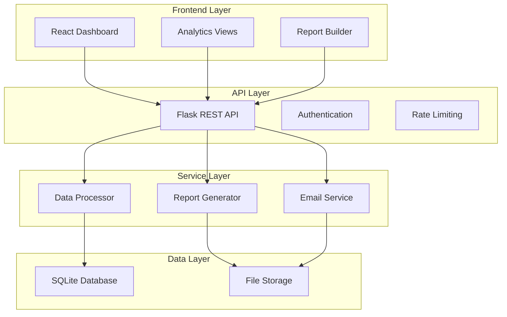

# 🎵 Prism Analytics - Music Data Intelligence Platform

[](https://opensource.org/licenses/MIT)
[](https://www.python.org/downloads/)
[](https://reactjs.org/)
[](https://www.docker.com/)

> **Professional music analytics platform for artists, labels, and industry professionals. Generate Spotify Wrapped-style reports, analyze streaming performance, and gain actionable insights from your music data.**


## 🚀 Quick Start

### One-Command Deployment
```bash
git clone <your-repo-url>
cd music-analytics-platform
chmod +x deploy.sh
./deploy.sh
```

**That's it!** Your platform will be available at:
- 🖥️ **Dashboard**: http://localhost:3000
- 🔌 **API**: http://localhost:5000
- 📚 **Docs**: http://localhost:5000/api/v1/docs

## ✨ Key Features

### 📊 **Analytics Dashboard**
- Real-time streaming metrics visualization
- Multi-platform performance tracking
- Geographic performance mapping
- Trending artists and tracks
- Interactive charts with Recharts

### 📱 **Spotify Wrapped-Style Reports**
- Professional PDF report generation
- Personalized artist insights
- Annual and monthly summaries
- Automated email delivery
- Custom branding and themes

### 🎯 **Multi-Platform Support**
- **Streaming**: Spotify, Apple Music, Amazon Music, Deezer, Tidal
- **Video**: YouTube Music, Vevo
- **Social**: TikTok, Instagram, Facebook
- **Regional**: JioSaavn, Gaana, Anghami, Boomplay

### 🔍 **Advanced Analytics**
- Cross-platform performance comparison
- Geographic heat maps
- Time-series trend analysis
- Artist growth tracking
- Custom date range filtering

## 🏗️ Architecture Overview



## 🛠️ Technology Stack

### Backend
- **Framework**: Flask 2.3+ with RESTful APIs
- **Database**: SQLite with SQLAlchemy ORM
- **PDF Generation**: WeasyPrint with custom templates
- **Email**: SMTP with HTML templates
- **Data Processing**: Pandas + NumPy
- **Authentication**: JWT tokens

### Frontend
- **Framework**: React 18 with Hooks
- **Styling**: Tailwind CSS with custom components
- **Charts**: Recharts for interactive visualizations
- **Icons**: Lucide React
- **HTTP Client**: Fetch API with custom hooks

### Infrastructure
- **Containerization**: Docker + Docker Compose
- **Reverse Proxy**: Nginx (production)
- **File Processing**: Multi-format support (CSV, Excel, TSV)
- **Caching**: Flask-Caching with Redis support

## 📋 Prerequisites

### System Requirements
- **Docker** 20.10+ and **Docker Compose**
- **4GB RAM** minimum (8GB recommended)
- **2GB disk space** for application and data
- **Modern web browser** (Chrome, Firefox, Safari, Edge)

### Development Requirements (Optional)
- **Python 3.11+** for local development
- **Node.js 18+** and **npm** for frontend development
- **Git** for version control

## 🚀 Installation & Deployment

### Option 1: Quick Deploy (Recommended)
```bash
# Clone and deploy in one command
git clone <your-repo-url>
cd music-analytics-platform
chmod +x deploy.sh
./deploy.sh
```

### Option 2: Manual Docker Setup
```bash
# 1. Clone repository
git clone <your-repo-url>
cd music-analytics-platform

# 2. Create environment file
cp .env.example .env
# Edit .env with your configuration

# 3. Deploy with Docker Compose
docker-compose up -d --build

# 4. Initialize database
docker-compose exec backend python -c "
from models.database import init_database
init_database()
"

# 5. Generate sample data (optional)
docker-compose exec backend python utils/config.py generate
```

### Option 3: Development Setup
```bash
# Backend
cd backend
python -m venv venv
source venv/bin/activate  # Linux/Mac
pip install -r requirements.txt
flask run --debug

# Frontend (separate terminal)
cd frontend
npm install
npm start
```

## 📊 Data Upload & Processing

### Supported File Formats
- **CSV files** (comma, tab, semicolon, pipe separated)
- **Excel files** (.xlsx, .xls)
- **Text files** (.txt, .tsv)

### Data File Structure

#### Streaming Data Example
```csv
ISRC,Artist,Track,Country,Platform,Streams,Date
USRC17607839,Taylor Swift,Anti-Hero,US,Spotify,1234567,2024-01
GBUM71507078,Ed Sheeran,Shape of You,GB,Apple Music,567890,2024-01
```

#### Apple Music Data Example
```csv
Apple Identifier,Storefront Name,Streams,Subscription Type,Datestamp
1234567890,United States,45678,Premium,2024-01-15
```

### Upload Process
1. **Place files** in `data/raw/` directory
2. **Organize by platform** (optional): `data/raw/spotify/`, `data/raw/apple/`
3. **Run processor**: 
   ```bash
   docker-compose exec backend python -c "
   from services.data_processor import MusicDataProcessor
   processor = MusicDataProcessor()
   processor.process_folder('/app/data/raw')
   "
   ```

## 📈 Report Generation

### Wrapped Reports (Annual)
Generate comprehensive year-end reports similar to Spotify Wrapped:

```bash
# Via API
curl -X POST http://localhost:5000/reports/generate/wrapped \
  -H "Content-Type: application/json" \
  -d '{
    "artist_id": "SPOTIFY_TAYLOR_SWIFT",
    "year": 2024,
    "email": "artist@example.com"
  }'
```

**Report Contents:**
- 📊 Total streams and growth metrics
- 🎵 Top 10 tracks with performance data
- 🌍 Global reach and country breakdown
- 📱 Platform performance analysis
- 📈 Monthly growth trends
- 🎯 Peak performance insights

### Monthly Reports
```bash
curl -X POST http://localhost:5000/reports/generate/monthly \
  -H "Content-Type: application/json" \
  -d '{
    "artist_id": "SPOTIFY_TAYLOR_SWIFT",
    "year": 2024,
    "month": 12
  }'
```

### Frontend Report Builder
1. Navigate to **Reports** section
2. Select artist from dropdown
3. Choose report type and period
4. Click **Generate Report**
5. Download PDF or email directly

## 🔧 Configuration

### Environment Variables (.env)
```env
# API Configuration
API_SECRET_KEY=your-secure-api-key
FLASK_ENV=production

# Database
DATABASE_URL=sqlite:///data/music_analytics.db

# Frontend
REACT_APP_API_URL=http://localhost:5000/api/v1

# Email Service
SMTP_SERVER=smtp.gmail.com
SMTP_PORT=587
SMTP_USERNAME=your-email@gmail.com
SMTP_PASSWORD=your-app-password
FROM_EMAIL=your-email@gmail.com
FROM_NAME=Prism Analytics

# Limits
MAX_FILE_SIZE_MB=100
RATE_LIMIT_PER_DAY=1000
RATE_LIMIT_PER_HOUR=100
```

### Email Setup (Gmail Example)
1. Enable 2-factor authentication
2. Generate app-specific password
3. Update `.env` file:
   ```env
   SMTP_USERNAME=your-email@gmail.com
   SMTP_PASSWORD=your-app-password
   ```

## 📖 API Documentation

### Core Endpoints

#### Dashboard Data
```bash
GET /api/v1/dashboard/overview
# Returns: total streams, artists, platforms, growth metrics

GET /api/v1/artists/trending?limit=10
# Returns: trending artists with growth percentages
```

#### Analytics
```bash
GET /api/v1/analytics/platforms
# Returns: platform performance and market share

GET /api/v1/analytics/geographic
# Returns: geographic performance data

GET /api/v1/analytics/timeseries?period=daily&days=30
# Returns: time series data for charts
```

#### Artist Data
```bash
GET /api/v1/artists/{artist_id}
# Returns: detailed artist analytics

GET /api/v1/search/artists?q=taylor&limit=20
# Returns: artist search results
```

#### Report Generation
```bash
POST /reports/generate/wrapped
POST /reports/generate/monthly
POST /reports/preview/wrapped
```

### Response Format
```json
{
  "success": true,
  "data": { ... },
  "timestamp": "2024-01-15T10:30:00Z"
}
```

## 🎨 Customization

### Brand Colors
Default Prism Analytics theme:
```css
:root {
  --primary: #1A1A1A;    /* Prism Black */
  --accent: #E50914;     /* Precise Red */
  --secondary: #333333;  /* Charcoal Gray */
  --background: #FFFFFF; /* Pure White */
}
```

### Custom Reports
Modify `backend/templates/wrapped_report.html` for custom report layouts.

### Frontend Themes
Edit `frontend/src/styles/brand.css` for custom styling.

## 🧪 Testing & Development

### Run Tests
```bash
# Backend tests
cd backend
python -m pytest tests/

# Frontend tests
cd frontend
npm test
```

### Development Tools
```bash
# View logs
docker-compose logs -f backend
docker-compose logs -f frontend

# Database inspection
docker-compose exec backend python -c "
from models.database import get_db_engine
import pandas as pd
engine = get_db_engine()
print(pd.read_sql('SELECT COUNT(*) FROM fact_music_metrics', engine))
"

# API health check
curl http://localhost:5000/health
```

## 📊 Performance & Monitoring

### Database Optimization
```sql
-- Key indexes are automatically created
CREATE INDEX idx_metrics_platform ON fact_music_metrics(platform_id);
CREATE INDEX idx_metrics_date ON fact_music_metrics(date_id);
CREATE INDEX idx_tracks_artist ON dim_tracks(artist_id);
```

### Monitoring Endpoints
- `/health` - Application health
- `/api/v1/dashboard/overview` - Performance metrics
- Container logs via `docker-compose logs`

### Scale Considerations
- **SQLite** handles up to 1M records efficiently
- For larger datasets, migrate to **PostgreSQL**
- Use **Redis** for production caching
- Add **load balancer** for multiple instances

## 🔒 Security

### Production Security Checklist
- [ ] Change default API keys
- [ ] Enable HTTPS with SSL certificates
- [ ] Configure firewall rules
- [ ] Set up API rate limiting
- [ ] Regular security updates
- [ ] Backup encryption

### SSL Setup
```bash
# Generate SSL certificates
mkdir ssl
openssl req -x509 -nodes -days 365 -newkey rsa:2048 \
  -keyout ssl/nginx.key -out ssl/nginx.crt

# Enable HTTPS
docker-compose --profile production up -d
```

## 🚀 Production Deployment

### Cloud Deployment (AWS/GCP/Azure)
1. **Launch VM** with Docker support
2. **Clone repository** and configure
3. **Set up domain** and SSL certificates
4. **Configure backup** and monitoring
5. **Scale horizontally** as needed

### Docker Production
```yaml
# docker-compose.prod.yml
version: '3.8'
services:
  backend:
    restart: always
    environment:
      - FLASK_ENV=production
  frontend:
    restart: always
  nginx:
    image: nginx:alpine
    ports:
      - "80:80"
      - "443:443"
    restart: always
```

## 🔄 Maintenance

### Regular Tasks
```bash
# Update application
./deploy.sh update

# Backup data
./deploy.sh backup

# Clean system
./deploy.sh clean

# View status
./deploy.sh status
```

### Data Backup
```bash
# Automatic backup
cp data/music_analytics.db backups/backup_$(date +%Y%m%d).db
tar -czf backups/reports_$(date +%Y%m%d).tar.gz reports/generated/
```

## 🛠️ Troubleshooting

### Common Issues

#### Services Won't Start
```bash
# Check Docker status
docker info
docker-compose ps

# View logs
docker-compose logs backend
docker-compose logs frontend
```

#### Database Issues
```bash
# Reset database
rm data/music_analytics.db
docker-compose exec backend python -c "
from models.database import init_database
init_database()
"
```

#### File Processing Errors
```bash
# Check file permissions
ls -la data/raw/

# Test file reading
docker-compose exec backend python -c "
from utils.file_handlers import FileHandler
handler = FileHandler()
print(handler.discover_files('/app/data/raw'))
"
```

#### Memory Issues
```bash
# Increase Docker memory limits
# Edit Docker Desktop settings or docker-compose.yml:
services:
  backend:
    mem_limit: 2g
```

### Performance Issues
- Check database size: Large datasets may need PostgreSQL
- Monitor memory usage: `docker stats`
- Review file sizes: Large uploads may timeout
- Check disk space: Reports and data accumulate

### Getting Help
- **Documentation**: This README and inline code comments
- **Logs**: Always check `docker-compose logs` first
- **GitHub Issues**: Report bugs and feature requests
- **Community**: Join our Discord/Slack (if available)

## 🤝 Contributing

### Development Workflow
1. **Fork** the repository
2. **Create** feature branch: `git checkout -b feature/amazing-feature`
3. **Commit** changes: `git commit -m 'Add amazing feature'`
4. **Push** branch: `git push origin feature/amazing-feature`
5. **Open** Pull Request

### Code Standards
- **Python**: Follow PEP 8, use Black formatter
- **JavaScript**: ESLint + Prettier configuration
- **Git**: Conventional commit messages
- **Testing**: Add tests for new features

## 📚 Additional Resources

### Documentation
- [Flask Documentation](https://flask.palletsprojects.com/)
- [React Documentation](https://reactjs.org/docs/)
- [Docker Documentation](https://docs.docker.com/)
- [SQLAlchemy Documentation](https://docs.sqlalchemy.org/)

### Music Industry APIs
- [Spotify Web API](https://developer.spotify.com/documentation/web-api/)
- [Apple Music API](https://developer.apple.com/documentation/applesearch)
- [YouTube Analytics API](https://developers.google.com/youtube/analytics)

## 📄 License

This project is licensed under the MIT License - see the [LICENSE](LICENSE) file for details.

## 🙏 Acknowledgments

- **Music Industry**: For inspiring better analytics tools
- **Open Source Community**: For the amazing libraries and frameworks
- **Artists & Labels**: For trusting us with their data insights
- **Contributors**: Everyone who helped build this platform

---

**Built with ❤️ for the music industry**

*Prism Analytics - Turning music data into actionable insights*

## 📞 Support

For support, email ces@precise.digital or create an issue on GitHub.

**Remember to ⭐ star this repository if you find it useful!**